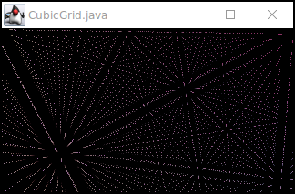
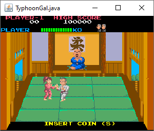
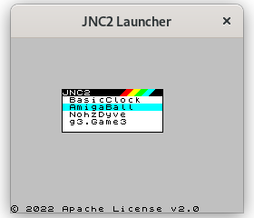

# jnc3
video engine on java awt

### [XScreenSaver](https://www.jwz.org/xscreensaver/screenshots/) Cubic Grid

mvn compile exec:java -pl legacy -Dexec.mainClass=ab.jnc2.CubicGrid

### Typhoon Gal (c) Taito 1985 - arcade machine emulator

mvn compile exec:java -pl legacy -Dexec.mainClass=ab.jnc2.TyphoonGal

### Mathematical model of Nyan Cat

mvn compile exec:java -pl legacy -Dexec.mainClass=ab.nyancat.NyanCat

### JNC2 Launcher

mvn compile exec:java -pl legacy -Dexec.mainClass=ab.jnc2.Application

### NohzDyve - java replica

mvn compile exec:java -pl legacy -Dexec.mainClass=ab.jnc2.NohzDyve

[video](https://youtu.be/BISPHmAuor8)

### Amiga Ball

mvn compile exec:java -pl legacy -Dexec.mainClass=ab.jnc2.AmigaBall

